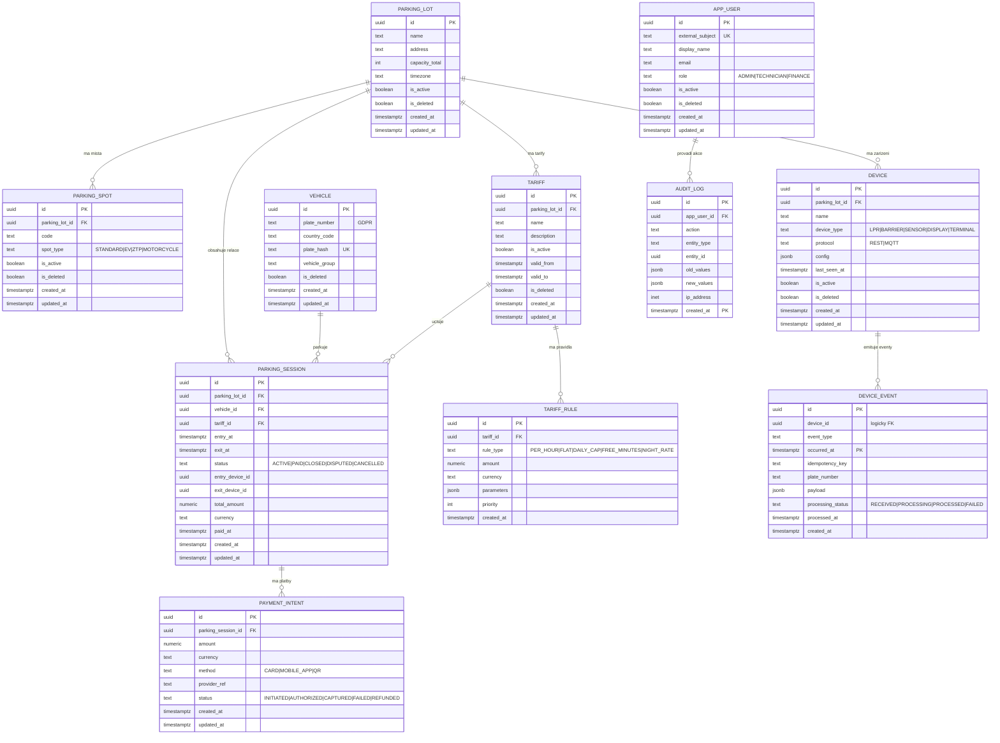

# ER Diagram — VPSI Parkovaci system

> Automaticky generovany diagram databazoveho schematu.

## Poznamky

- **device_event** a **audit_log** jsou partitioned tabulky (range by mesic) — composite PK `(id, occurred_at)` resp. `(id, created_at)`
- **device_event.device_id** nema FK constraint kvuli partitioning limitaci PostgreSQL
- **parking_session.entry_device_id/exit_device_id** jsou logicke odkazy bez FK constraint
- **vehicle.plate_number** je osobni udaj dle GDPR — reseno pres plate_hash pro vyhledavani
