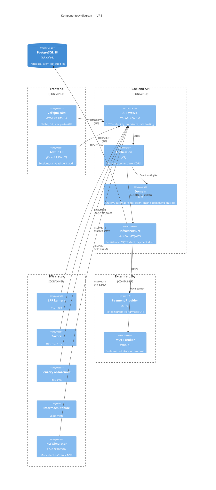
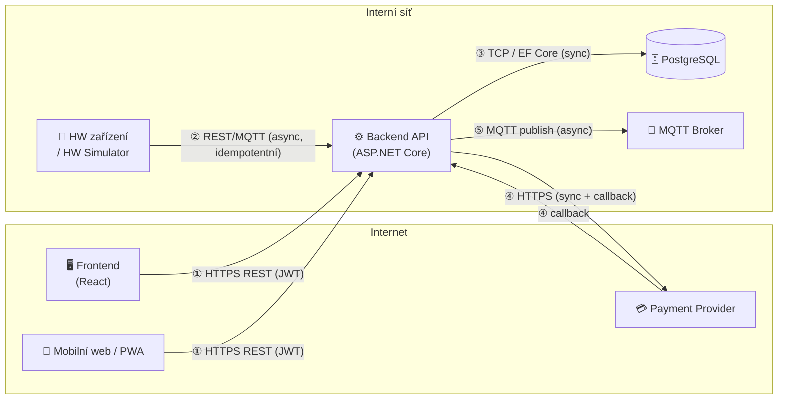
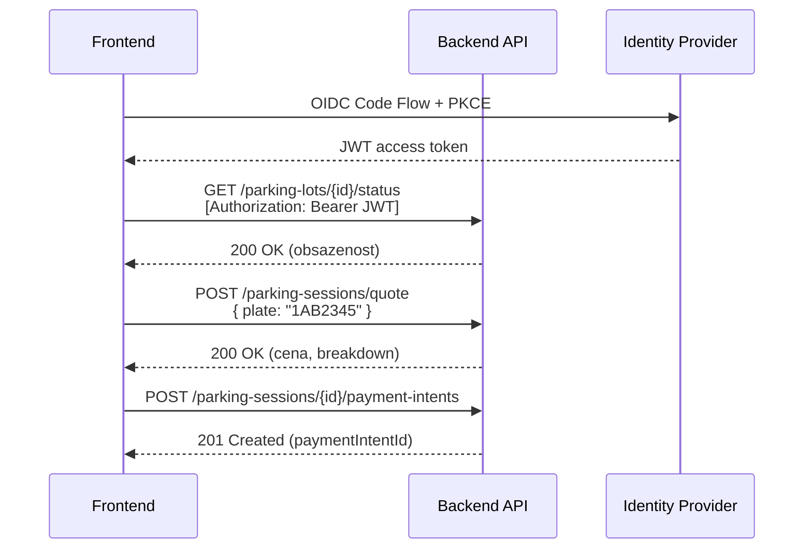
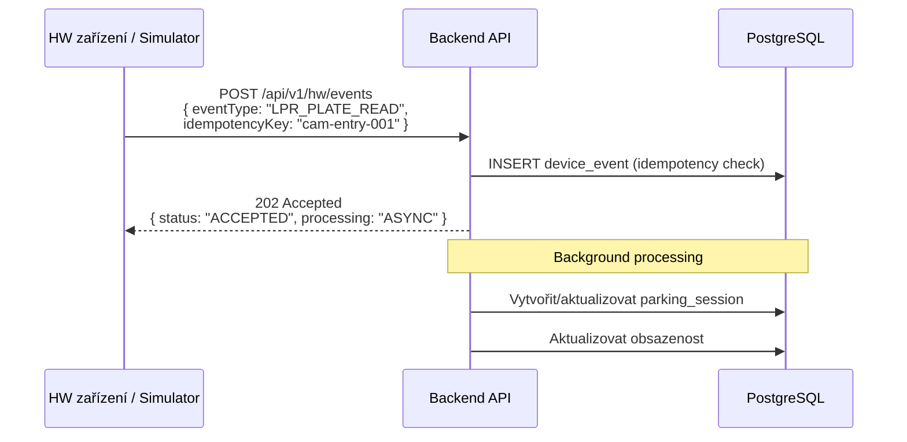
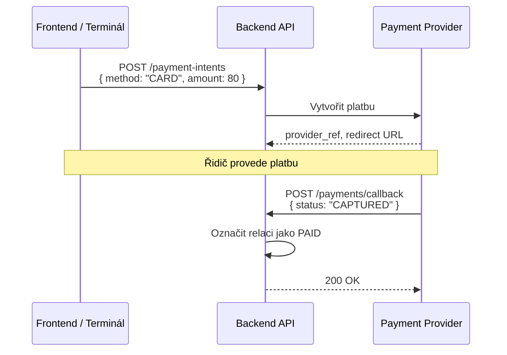
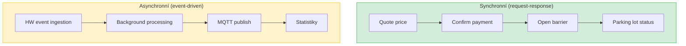
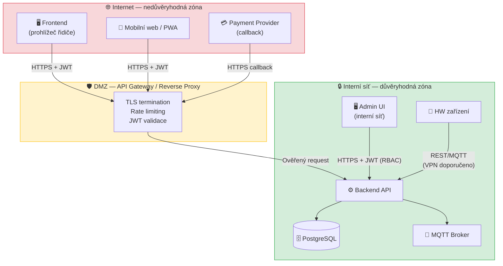

# Architektonický přehled systému VPSI

> Vizuální vstupní bod do architektury automatického parkoviště.
> Detailní návrh (use-casy, datový model, API kontrakty, nasazení, bezpečnost) viz [vpsi.md](vpsi.md).

---

## 1. Přehled vrstev

Systém se skládá ze šesti hlavních vrstev. V MVP jsou HW zařízení nahrazena simulátorem.



### Odpovědnosti vrstev

| Vrstva | Odpovědnost | Technologie | Složka v monorepu |
|--------|-------------|-------------|-------------------|
| **Frontend — veřejná část** | Platba za parkování, QR sken, zobrazení stavu parkoviště | React 19, Vite, TypeScript | `frontend/` |
| **Frontend — admin UI** | Správa sessions, tarifů, zařízení, audit log | React 19, Vite, TypeScript | `frontend/` |
| **Backend — API** | REST endpointy, JWT autorizace, rate limiting, validace | ASP.NET Core 10 | `backend/src/Vpsi.Api/` |
| **Backend — Application** | Use-casy, orchestrace operací, CQRS handlery | C# | `backend/src/Vpsi.Application/` |
| **Backend — Domain** | Stavový automat parkovací relace, tarifní engine, doménová pravidla | C# | `backend/src/Vpsi.Domain/` |
| **Backend — Infrastructure** | EF Core persistence, MQTT klient, payment klient, external integrace | EF Core, C# | `backend/src/Vpsi.Infrastructure/` |
| **PostgreSQL** | Transakční data, event log, audit log | PostgreSQL 18 | `database/` |
| **MQTT Broker** | Real-time notifikace obsazenosti (volitelné) | MQTT 5 | `docker/` |
| **HW vrstva / HW Simulator** | LPR kamera, závora, senzory, tabule — v MVP mockované | .NET 10 Worker Service | `hw-simulator/` |
| **Payment Provider** | Externí platební brána (karta/mobil/QR) | HTTPS | — (externí) |

---

## 2. Komunikační mapa

### Přehledová tabulka

| # | Odkud | Kam | Protokol | Typ | Poznámka |
|---|-------|-----|----------|-----|----------|
| 1 | Frontend | Backend API | HTTPS REST | Sync | JWT bearer auth |
| 2 | HW (LPR/senzory) | Backend API | REST / MQTT | Async | Idempotentní (`idempotency_key`) |
| 3 | Backend | PostgreSQL | TCP (EF Core) | Sync | Transakce, audit log |
| 4 | Backend | Payment Provider | HTTPS | Sync + Callback | PCI minimální scope |
| 5 | Backend | MQTT Broker | MQTT | Async | Publish obsazenosti |

### Komunikační diagram



---

## 3. Detailní popisy komunikačních toků

### ① Frontend → Backend API

- **Protokol:** HTTPS REST (JSON)
- **Autentizace:** JWT bearer token
- **Autorizační flow:** OIDC Authorization Code + PKCE
- **Klíčové endpointy:**
  - `GET /api/v1/parking-lots/{lotId}/status` — stav obsazenosti
  - `POST /api/v1/parking-sessions/quote` — výpočet ceny
  - `POST /api/v1/parking-sessions/{id}/payment-intents` — zahájení platby
  - `GET /api/v1/admin/sessions` — admin přehled relací
  - `POST /api/v1/admin/tariffs` — správa tarifů



### ② HW zařízení → Backend API

- **Protokol:** REST (`POST /api/v1/hw/events`) nebo MQTT
- **Zpracování:** Asynchronní (ACK + background processing)
- **Idempotence:** Klíč `idempotency_key` — duplicitní event se nezpracuje znovu
- **Event log:** Každý event se ukládá do `device_event` tabulky



### ③ Backend → PostgreSQL

- **Protokol:** TCP přes EF Core (Npgsql)
- **Transakce:** Atomické operace přes `DbContext`
- **Klíčové tabulky:** `parking_session`, `payment_intent`, `device_event`, `audit_log`
- **Audit:** Každá admin akce vytváří záznam v `audit_log`

### ④ Backend → Payment Provider

- **Protokol:** HTTPS REST
- **Flow:** Backend vytvoří payment intent → Provider zpracuje platbu → Callback/confirm zpět na backend
- **PCI scope:** Minimální — backend neukládá cardholder data, deleguje na poskytovatele



### ⑤ Backend → MQTT Broker

- **Protokol:** MQTT 5
- **Směr:** Backend publish → Broker → subscribenti (tabule, FE dashboard)
- **Topic:** `vpsi/{lotId}/occupancy`
- **Payload:** `{ free: 33, total: 120, updatedAt: "..." }`
- **Použití:** Real-time aktualizace informační tabule a dashboardu

---

## 4. Synchronní vs asynchronní komunikace

### Synchronní operace

Operace, kde volající čeká na okamžitou odpověď:

| Operace | Endpoint / kanál | Důvod sync |
|---------|-----------------|------------|
| Výpočet ceny (quote) | `POST /parking-sessions/quote` | Řidič čeká na částku |
| Potvrzení platby | `POST /payments/{id}/confirm` | Závora se otevírá na základě výsledku |
| Rozhodnutí o otevření závory | Interní logika po LPR read | Řidič čeká u závory |
| Stav obsazenosti | `GET /parking-lots/{id}/status` | Okamžitý stav pro UI |
| Admin CRUD operace | `GET/POST /admin/*` | Přímá interakce uživatele |

### Asynchronní operace

Operace, kde se odpovídá ACK a zpracování běží na pozadí:

| Operace | Mechanismus | Důvod async |
|---------|------------|-------------|
| HW event ingestion | `POST /hw/events` → 202 Accepted | Vysoký throughput, batch zpracování |
| Background processing eventů | Hosted Service / Worker | Oddělení příjmu od zpracování |
| MQTT notifikace obsazenosti | MQTT publish | Fire-and-forget, real-time |
| Statistiky a reporting | Scheduled job | Výpočetně náročné, neblokuje API |
| Monitoring a alerting | Background service | Kontinuální kontrola health |

### Diagram: Sync vs Async flow



---

## 5. Trust Boundaries

### Diagram bezpečnostních zón



### Bezpečnostní opatření na hranicích

| Hranice | Opatření |
|---------|----------|
| **Internet → API** | TLS 1.3 na všech externích spojeních |
| **Internet → API** | JWT bearer validace na každém requestu |
| **Internet → API** | Rate limiting na veřejných endpointech (quote, payment) |
| **Internet → API** | CORS politika pro povolené domény |
| **Payment callback → API** | Ověření podpisu callbacku (webhook signature) |
| **HW → API** | VPN / privátní síť (doporučeno pro produkci) |
| **HW → API** | Autentizace zařízení (API klíč / certifikát) |
| **Admin UI → API** | OIDC + RBAC (role: ADMIN, TECHNICIAN, FINANCE) |
| **API → DB** | Přístup pouze z backend kontejneru, šifrované spojení |
| **Všechny zóny** | Audit log všech bezpečnostně relevantních operací |

---

## 6. Mapování na monorepo strukturu

```
VPSI/
├── frontend/                  # React 19, Vite, TypeScript
│   └── src/
│       ├── pages/             # Veřejná část + Admin UI
│       ├── components/        # Sdílené komponenty
│       └── api/               # API klient
│
├── backend/                   # ASP.NET Core 10, Clean Architecture
│   └── src/
│       ├── Vpsi.Api/          # REST endpointy, middleware, autorizace
│       ├── Vpsi.Application/  # Use-casy, CQRS handlery, DTO
│       ├── Vpsi.Domain/       # Entity, value objects, stavový automat
│       └── Vpsi.Infrastructure/ # EF Core, MQTT klient, payment klient
│
├── hw-simulator/              # .NET 10 Worker Service — mock HW zařízení
│
├── database/                  # PostgreSQL 18 — migrace, seed data
│
├── contracts/                 # OpenAPI spec, JSON Schema, MQTT topics
│
├── docker/                    # Docker Compose — lokální dev stack
│
└── docs/                      # Dokumentace
    └── architecture/
        ├── architecture-overview.md  ← tento dokument
        ├── vpsi.md                   ← detailní systémový návrh
        └── adr/                      ← Architecture Decision Records
```

| Komponenta | Složka | Technologie |
|------------|--------|-------------|
| Frontend | `frontend/` | React 19, Vite, TypeScript |
| Backend API | `backend/src/Vpsi.Api/` | ASP.NET Core 10 |
| Application | `backend/src/Vpsi.Application/` | C# |
| Domain | `backend/src/Vpsi.Domain/` | C# |
| Infrastructure | `backend/src/Vpsi.Infrastructure/` | EF Core, C# |
| HW Simulator | `hw-simulator/` | .NET 10 Worker Service |
| DB schema | `database/` | PostgreSQL 18 |
| API kontrakty | `contracts/` | OpenAPI, JSON Schema, MQTT topics |
| Docker stack | `docker/` | Docker Compose |

---

## Další kroky

- Detailní systémový návrh: [vpsi.md](vpsi.md)
- Architecture Decision Records: [adr/](adr/)
- Lokální vývoj: [../guides/local-development.md](../guides/local-development.md)
