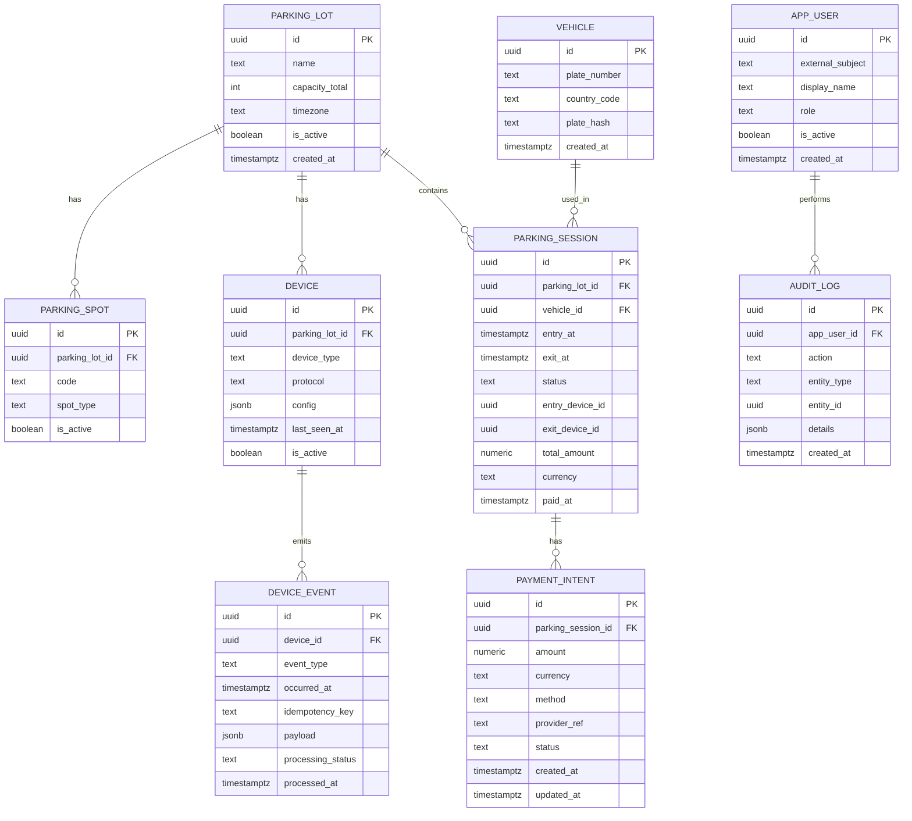
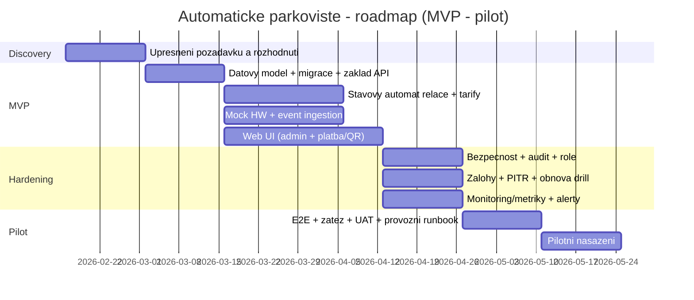

# Automaticke parkoviste - navrh software, use-casy, datovy model, API, nasazeni, bezpecnost, testovani a otazky pro klienta

> **Vizuální přehled architektury:** Pro diagramy komponent, komunikační mapu a trust boundaries viz [architecture-overview.md](architecture-overview.md).

## Exekutivni shrnuti

Navrhovany system je **self-service automaticke parkoviste** rizene pres **SPZ (LPR)**, **zavory**, **senzory obsazenosti**, **informacni tabuli u vjezdu** a **platbu pred vyjezdem** (karta / mobil / QR). Zakladni navrh je postaven tak, aby sel rychle dodat jako **MVP s HW mocky**, ale soucasne mel jasnou cestu k produkcni integraci (REST/MQTT, audit, bezpecnost, zalohy, monitoring).

Klicova architektonicka rozhodnuti, ktera je nutne od klienta ziskat brzy (jinak se navrh bude menit a prodrazi se):

- **Offline rezim / edge vs. ciste centralni rizeni** (co se ma stat pri vypadku internetu/centralniho backendu).
- **Platebni integrace** (externi poskytovatel/terminaly - dopad na PCI scope a provoz).
- **Retence a pravni ramec pro SPZ a kamerove zaznamy** (doby uchovani, ucely, audit).
- **Pozadovane SLA, pocet parkovist, pocet zarizeni, datove objemy** (nezadano) - ovlivnuje HA, skalovani, monitoring, naklady.

Doporuceni pro dodani "bez bolesti":

- Realizovat jadro jako **stavovy automat parkovaci relace** (entry - active - paid - exit/closed) + **event log z HW** (i kdyz zatim jen z mocku), aby se dobre resily spory, audit a ladeni.
- Nasazeni navrhnout ve variantach (on-prem / cloud / hybrid), ale pro pilot a iterace preferovat **kontejnerizaci** a standardni orchestrace (rolling update, readiness/liveness, secrets/config).
- Telemetrii a statistiky drzet jako **volitelny modul**, ale pripravit API/DB tak, aby sly doplnit bez refaktoru (domenove metriky + technicke metriky).

Vystup nize je pripraven tak, aby byl primo pouzitelny pro planovani sprintu: obsahuje use-casy, navrh ER/DB, API kontrakty, varianty nasazeni, bezpecnostni minimum, test plan, navrh metrik a predevsim **strukturovany seznam otazek pro klienta** vcetne "formulare".

## Kontext, predpoklady a hranice projektu

System ma ridit automatizovane parkoviste bez obsluhy, s identifikaci vozidel pomoci SPZ (LPR), nepustit auto pri plne kapacite, sledovat obsazenost stani (senzor/kamera/smycka), zobrazovat volna mista u vjezdu a evidovat cas prijezdu/odjezdu.

Platba probiha **pred vyjezdem** (terminal / mobilni aplikace), podporovane metody jsou karta, mobil, QR; system rozlisuje kratkodobe vs dlouhodobe parkovani a muze mit zvyhodnene tarify (rezidenti, zamestnanci).

Bezpecnostne a pravne: pozadavek na GDPR, role-based pristup do administrace (spravce, technik), omezena retence kamerovych zaznamu, logovani operaci, nouzovy vyjezd pri poruse.

Technicky: backend na centralnim serveru, relacni DB, komunikace se senzory pres REST/MQTT, webove UI, admin UI jen z interni site.

Analytika: denni/mesicni/rocni statistiky (vytizenost, prumerna doba parkovani, obrat), exporty dat, simulace vytizeni.

Nezadano (musi byt vyjasneno, jinak se navrh muze zasadne zmenit):

- Pocet parkovist a jejich topologie (1 lokalita vs sit), pocet vjezdu/vyjezdu, typy zarizeni.
- SLA/SLO (dostupnost, RTO/RPO), rezim udrzby, provozni podpora 24/7 (nezadano, pritom system bezi 24/7).
- Objem dat a retencni politiky (parkovaci relace, eventy, video), pozadavky na anonymizaci/pseudonymizaci SPZ.
- Presna tarifni pravidla (zaokrouhlovani, free-minutes, denni stropy, penalizace, ztracena SPZ apod.).
- Platebni poskytovatel a odpovednost za PCI (nezadano).
- Mobilni aplikace: zda vubec, a zda iOS (nezadano).

## Klicove funkce a detailni use-casy

Funkcne je system nejlepe chapat jako **"orchestrator parkovaci relace"**: z HW udalosti (LPR, zavorova jednotka, senzory) sestavi pravdu o tom, kdo je uvnitr, kolik je volno, kolik ma zaplatit, a zda smi ven.

Nasledujici tabulka je zamerne psana tak, aby se z ni daly rovnou delat backlogove itemy (MVP vs rozsireni je uvedeno v alternativach).

### Use-case tabulka

| Use-case | Akteri | Predpoklady | Hlavni scenar | Alternativy / vyjimky |
|----------|--------|-------------|---------------|----------------------|
| Vjezd vozidla na parkoviste | Ridic, LPR, zavora | Parkoviste neni plne; LPR vrati SPZ s dostatecnou jistotou. | 1) LPR na vjezdu precte SPZ. 2) System overi kapacitu. 3) Vytvori parkovaci relaci s casem prijezdu. 4) Otevre zavoru. | A) Parkoviste plne - zavoru neotevrit, zobrazit "plno" na tabuli. B) LPR nejiste/selze - fallback (rucni zadani na terminalu / obsluha hotline / "guest ticket") - nezadano. |
| Zobrazeni obsazenosti u vjezdu | Ridic, informacni tabule, senzory | Senzory poskytuji obsazenost per stani nebo agregovane. | 1) System prubezne pocita volna mista. 2) Publikuje cislo na informacni tabuli. | A) Porucha casti senzoru - prepnout na "kapacita minus aktivni relace" (mene presne). B) Tabule offline - logovat a alertovat. |
| Parkovani do vyhrazenych mist (EV/ZTP/car-sharing) | Ridic, admin, senzory | Mista maji typ; pravidla pro opravneni jsou definovana (nezadano). | 1) System eviduje typy stani. 2) (Volitelne) pri detekci obsazeni vyhrazeneho mista vozidlem bez opravneni vytvori incident. | A) Vyhodnoceni opravneni muze byt pouze "reporting" bez sankci (MVP). B) Napojeni na registr opravneni (rezidenti, zamestnanci) - nezadano. |
| Zahajeni platby podle SPZ | Ridic, platebni terminal / web, backend | Existuje aktivni relace pro SPZ; tarif je znam. | 1) Ridic zada/nacte SPZ / QR. 2) Backend spocita cenu dle tarifu a doby. 3) Vytvori "payment intent". 4) Terminal/prohlizec provede platbu. | A) SPZ nenalezena - nabidnout "vyhledat podle casu/vjezdu" (nezadano). B) Tarifni pravidla slozita - tarifni engine s verzovanim (doporuceno). |
| Platba kartou na terminalu | Ridic, terminal, payment provider | Terminal je integrovan; neukladame PAN; resi se PCI scope (nezadano). | 1) Terminal odesle pozadavek na castku. 2) Provider vrati vysledek. 3) Backend oznaci relaci jako "paid". | A) Platba fail - relace zustava "active", nabidnout retry / jinou metodu. B) Refundace/storno - nezadano (nutne doplnit). |
| Platba pres mobilni aplikaci / QR | Ridic, mobilni web/app, backend | Mobilni kanal existuje (nezadano); identifikace relace QR / SPZ. | 1) Ridic otevre QR link / app. 2) Overi relaci. 3) Zaplati (platebni brana). 4) Backend oznaci "paid". | A) Bez mobilni aplikace: web (PWA) jako MVP. B) Nativni Android az pokud bude potreba (nezadano). |
| Vyjezd vozidla | Ridic, LPR, zavora | Relace je paid nebo ma narok na bezplatny vyjezd; LPR precte SPZ. | 1) LPR na vyjezdu cte SPZ. 2) Backend overi "paid" a casovy limit po platbe. 3) Otevre zavoru. 4) Uzavre relaci s casem odjezdu. | A) Paid vyprsel (timeout) - dopocitat doplatek. B) LPR fail - fallback (QR z terminalu, rucni overeni) - nezadano. |
| Nouzovy vyjezd pri poruse | Ridic, technik, zavora | Nastane porucha, musi byt umoznen vyjezd. | 1) Technik aktivuje "fail-open rezim" (casove omezeny). 2) System loguje operaci. 3) Vyjezd se povoli bez platebni kontroly. | A) Edge rezim: lokalni ridici jednotka otevre bez backendu (nezadano). B) Pozdejsi douctovani/incidenty - nezadano. |
| Sprava tarifu | Spravce | Existuje admin pristup s RBAC. | 1) Spravce zalozi tarifni plan/verzi. 2) Nastavi pravidla. 3) Aktivuje od data. | A) Tarifni zmeny se musi auditovat a verzovat (doporuceno). |
| Sprava zarizeni a jejich stavu | Technik | Zarizeni jsou evidovana; periodicky hlasi heartbeat. | 1) Technik registruje zarizeni (typ, protokol). 2) Sleduje last-seen a chyby. 3) Spousti diagnostiku. | A) V MVP pouze evidence a rucni status. B) V produkci automaticke alerty a metriky. |
| Audit a dohledatelnost operaci | Spravce, auditor | Logy a audit trail jsou povinne. | 1) Kazda admin akce vytvori audit zaznam. 2) HW eventy se ukladaji (alespon metadata). 3) Lze dohledat spor (cas, SPZ, platba, otevreni zavory). | A) Retence musi odpovidat GDPR a internim pravidlum; SPZ je osobni udaj (v CZ praxi explicitne potvrzovano). |
| Reporting a export dat | Spravce, finance | Statistiky jsou pozadovany; export format nezadan. | 1) System generuje denni/mesicni/rocni prehledy. 2) Umozni export (CSV/XLSX/API). | A) Automaticka distribuce e-mailem - nezadano. B) Simulace vytizeni - samostatny modul. |

## Navrh datoveho modelu a PostgreSQL schema

Datovy model je navrzen tak, aby pokryl:

- **operativu** (parkovaci relace, platby, vjezdy/vyjezdy),
- **zarizeni a eventy** (HW integrace pres REST/MQTT, zatim mock),
- **audit a reporting** (logy, statistiky, export).

Pro flexibilni casti (napr. payloady z HW, pripadne tarifni pravidla) pouziva JSONB, ktery je v PostgreSQL standardne podporovany a indexovatelny (GIN).

### ER diagram



### Tabulka entit a poli

| Entita | Ucel | Klicova pole (typ) |
|--------|------|-------------------|
| `parking_lot` | Konfigurace parkoviste (kapacita, tz) | `id uuid`, `name text`, `capacity_total int`, `timezone text`, `is_active bool`, `created_at timestamptz` |
| `parking_spot` | Stani + typ (standard/EV/ZTP/...) | `id uuid`, `parking_lot_id uuid`, `code text`, `spot_type text`, `is_active bool` |
| `device` | Evidence HW prvku (i mocku) | `id uuid`, `parking_lot_id uuid`, `device_type text`, `protocol text`, `config jsonb`, `last_seen_at timestamptz`, `is_active bool` |
| `device_event` | Nezmenitelny log HW udalosti | `id uuid`, `device_id uuid`, `event_type text`, `occurred_at timestamptz`, `idempotency_key text`, `payload jsonb`, `processing_status text`, `processed_at timestamptz` |
| `vehicle` | Vozidlo identifikovane SPZ | `id uuid`, `plate_number text`, `country_code text`, `plate_hash text`, `created_at timestamptz` |
| `parking_session` | Parkovaci relace (entry-exit) | `id uuid`, `parking_lot_id uuid`, `vehicle_id uuid`, `entry_at timestamptz`, `exit_at timestamptz`, `status text`, `total_amount numeric`, `currency text`, `paid_at timestamptz` |
| `payment_intent` | Stav platby a integrace na providera | `id uuid`, `parking_session_id uuid`, `amount numeric`, `method text`, `provider_ref text`, `status text`, `created_at timestamptz` |
| `app_user` | Admin uzivatel mapovany z IdP | `id uuid`, `external_subject text`, `display_name text`, `role text`, `is_active bool` |
| `audit_log` | Auditni stopa admin akci | `id uuid`, `app_user_id uuid`, `action text`, `entity_type text`, `entity_id uuid`, `details jsonb`, `created_at timestamptz` |

Poznamka k GDPR: SPZ muze byt osobni udaj, pokud je priraditelna konkretni fyzicke osobe; v ceskem kontextu byly publikovany materialy a rozhodnuti, kde je SPZ vyslovne povazovana za osobni udaj.

### Zakladni PostgreSQL schema

```sql
-- rozsireni (volitelne: uuid, crypto)
create extension if not exists "uuid-ossp";
create extension if not exists pgcrypto;

create table parking_lot (
  id uuid primary key default uuid_generate_v4(),
  name text not null,
  capacity_total int not null check (capacity_total >= 0),
  timezone text not null default 'Europe/Prague',
  is_active boolean not null default true,
  created_at timestamptz not null default now()
);

create table vehicle (
  id uuid primary key default uuid_generate_v4(),
  plate_number text not null,
  country_code text null,
  plate_hash text not null,
  created_at timestamptz not null default now(),
  unique (plate_hash)
);

create table parking_session (
  id uuid primary key default uuid_generate_v4(),
  parking_lot_id uuid not null references parking_lot(id),
  vehicle_id uuid not null references vehicle(id),
  entry_at timestamptz not null,
  exit_at timestamptz null,
  status text not null, -- ACTIVE, PAID, CLOSED, DISPUTED...
  entry_device_id uuid null,
  exit_device_id uuid null,
  total_amount numeric(12,2) null,
  currency text not null default 'CZK',
  paid_at timestamptz null
);

create index ix_parking_session_active
  on parking_session(parking_lot_id, status, entry_at desc);

create table payment_intent (
  id uuid primary key default uuid_generate_v4(),
  parking_session_id uuid not null references parking_session(id),
  amount numeric(12,2) not null check (amount >= 0),
  currency text not null,
  method text not null, -- CARD, MOBILE_APP, QR
  provider_ref text null,
  status text not null, -- INITIATED, AUTHORIZED, CAPTURED, FAILED...
  created_at timestamptz not null default now(),
  updated_at timestamptz not null default now()
);

create table device (
  id uuid primary key default uuid_generate_v4(),
  parking_lot_id uuid not null references parking_lot(id),
  device_type text not null, -- LPR, BARRIER, SENSOR, DISPLAY, TERMINAL
  protocol text not null, -- REST, MQTT
  config jsonb not null default '{}'::jsonb,
  last_seen_at timestamptz null,
  is_active boolean not null default true
);

create table device_event (
  id uuid primary key default uuid_generate_v4(),
  device_id uuid not null references device(id),
  event_type text not null,
  occurred_at timestamptz not null,
  idempotency_key text not null,
  payload jsonb not null,
  processing_status text not null default 'RECEIVED',
  processed_at timestamptz null,
  unique (device_id, idempotency_key)
);

create index ix_device_event_occurred_at
  on device_event(device_id, occurred_at desc);

create table app_user (
  id uuid primary key default uuid_generate_v4(),
  external_subject text not null unique,
  display_name text not null,
  role text not null, -- ADMIN, TECHNICIAN, FINANCE
  is_active boolean not null default true,
  created_at timestamptz not null default now()
);

create table audit_log (
  id uuid primary key default uuid_generate_v4(),
  app_user_id uuid not null references app_user(id),
  action text not null,
  entity_type text not null,
  entity_id uuid null,
  details jsonb not null default '{}'::jsonb,
  created_at timestamptz not null default now()
);

create index ix_audit_log_created_at on audit_log(created_at desc);
```

Pouziti rozsireni `pgcrypto` (napr. pro hash/sifrovani vybranych hodnot) je v PostgreSQL standardni moznost.

Zalohovani a obnova v PostgreSQL ma standardni postupy (zalohy + WAL archiving pro PITR) a je vhodne je pozadovat uz od MVP prostredi, pokud ma system fungovat 24/7.

## Navrh API kontraktu

API je navrzeno primarne jako REST (snadne pro zarizeni i FE) s tim, ze pro admin dashboard lze volitelne pridat GraphQL (aby si UI tahalo presne to, co potrebuje, a pripadne realtime pres subscriptions).

### REST principy a dokumentace

- Kontrakty publikovat pres OpenAPI (Swagger), aby sly generovat klienty, testy a validace.
- Pouzivat standardni HTTP statusy a vyznamy dle HTTP Semantics a bezne praxe.
- Chyby vracet jednotne (napr. `application/problem+json`) a pro konflikty stavu (napr. "uz zaplaceno") vracet 409.

### Navrh endpointu

#### HW event ingestion (mock i budouci real)

`POST /api/v1/hw/events`

- Ucel: Jednotny vstup pro vsechny udalosti (LPR read, barrier opened/closed, spot occupied/free, terminal payment result...).
- Klicove vlastnosti: **idempotence** (stejny event nesmi vytvorit duplicitni relaci/platbu), auditovatelnost (uklada se `device_event`).

```json
{
  "deviceId": "b5e1a4a2-8c4f-4b1c-8b1a-9b4b4e8f4a11",
  "eventType": "LPR_PLATE_READ",
  "occurredAt": "2026-02-16T12:34:56Z",
  "idempotencyKey": "cam-entry-0000123456",
  "payload": {
    "plate": "1AB2345",
    "confidence": 0.93,
    "lane": "ENTRY_1",
    "imageRef": "optional://blob/...",
    "direction": "IN"
  }
}
```

Odpoved:

```json
{
  "status": "ACCEPTED",
  "correlationId": "b0a2a3f2d2f14c8c9a3fbe3d8b0ea1a1",
  "processing": "ASYNC"
}
```

Poznamka: pokud cast HW komunikace pobezi pres MQTT, je vhodne udrzet stejny event model (topic - eventType + payload). MQTT je standardni pub/sub protokol vhodny pro IoT scenare.

#### Operativni API pro FE / terminal

`GET /api/v1/parking-lots/{lotId}/status`

```json
{
  "lotId": "0f07f7d2-1a0c-4f36-9c3a-4fe3cc2b2a3c",
  "capacityTotal": 120,
  "occupied": 87,
  "free": 33,
  "calculatedAt": "2026-02-16T12:35:10Z"
}
```

`POST /api/v1/parking-sessions/quote`

- Ucel: spocitat cenu "k ted" pro danou SPZ (pro terminal/mobil).

```json
{ "plate": "1AB2345" }
```

```json
{
  "sessionId": "c8f03a1f-2d1d-4e07-8f5a-41b1e4f8fd67",
  "entryAt": "2026-02-16T10:12:00Z",
  "now": "2026-02-16T12:36:00Z",
  "amount": 80.0,
  "currency": "CZK",
  "pricingBreakdown": [{ "label": "casove parkovne", "amount": 80.0 }]
}
```

`POST /api/v1/parking-sessions/{sessionId}/payment-intents`

```json
{
  "method": "CARD",
  "amount": 80.0,
  "currency": "CZK"
}
```

```json
{
  "paymentIntentId": "f1c94d1a-7a7a-4b7e-8c0b-6a2a9c3e2a11",
  "status": "INITIATED",
  "providerRedirect": null
}
```

`POST /api/v1/payments/{paymentIntentId}/confirm`

- Vola terminal / backend integrace po vysledku providera.

```json
{
  "providerRef": "psp-987654321",
  "status": "CAPTURED",
  "capturedAt": "2026-02-16T12:37:10Z"
}
```

#### Admin API

- `GET /api/v1/admin/sessions?from=&to=&plate=`
- `POST /api/v1/admin/tariffs` (verzovani, aktivace)
- `GET /api/v1/admin/devices` (stav, last seen)
- `GET /api/v1/admin/audit`

Autorizace doporucene pres JWT bearer + OIDC/OAuth dle standardniho postupu v backendu (validace tokenu v API) a pro webove UI OIDC code flow s PKCE.

### Volitelne GraphQL pro dashboard a realtime

Pro admin dashboard lze pridat GraphQL, protoze podporuje query/mutation/subscription model a subscriptions jsou standardni mechanismus pro realtime update (typicky pres WebSocket).

Priklad schema zameru (zkraceno):

```graphql
type Query {
  parkingLot(id: ID!): ParkingLot!
  activeSessions(lotId: ID!): [ParkingSession!]!
}

type Subscription {
  occupancyUpdated(lotId: ID!): OccupancyEvent!
}
```

## Architektura reseni, varianty nasazeni a bezpecnost

### Architektura komponent

Logicke komponenty (MVP - produkce):

- FE (web): verejna cast (platba/QR) + admin portal (interni sit).
- Backend: API + tarifni engine + payment orchestrace + sprava zarizeni + reporting.
- DB: transakcni data + audit/event log.
- HW vrstva: v MVP mock services; v produkci adapter (REST/MQTT) na realne zarizeni.
- Observabilita: logy, metriky, tracing (volitelne).

Backendove background ulohy (napr. retence dat, generovani statistik, import/export) jsou v .NET standardne resitelne pres hosted services.

Konfigurace a secret management v kontejnerizovanem prostredi typicky vyuzivaji ConfigMaps/Secrets.

### Nasazeni - moznosti a doporuceni

Nize je realisticky vyber pro tento typ systemu. Rozhodnuti ma dopad na dostupnost 24/7 a reseni vypadku.

| Varianta | Kdy dava smysl | Typicke plus | Typicke minus |
|----------|----------------|--------------|---------------|
| On-prem (VM/metal) | pozadavek na lokalni provoz, omezeni cloudu | plna kontrola, lokalni latence | vyssi naklady na HA, zalohy, monitoring, patching |
| Cloud (AWS/Azure/GCP) | rychle skalovani, managed sluzby, iterace | standardni well-architected principy (security/reliability/cost) | zavislost na konektivite lokality, governance |
| Hybrid (edge + cloud) | parkoviste musi fungovat i pri vypadku internetu | nejlepsi UX pro ridice, robustni provoz | vyssi komplexita (sync, konflikty) |

Well-Architected ramce u velkych cloudu zduraznuji systematicky pristup pres pilire typu security/reliability/cost a maji pouzitelne checklisty pro navrh.

**Doporuceni (default):**

- Pro pilot/MVP: jednoduche nasazeni (1-2 prostredi) s moznosti prechodu na K8s bez prepisu (tedy kontejnerizace uz od zacatku). Rolling updates jsou standardni mechanismus pro bezvypadkove nasazovani v orchestraci.
- Pro produkci: pokud klient nepotrebuje striktni on-prem a konektivita lokality je spolehliva, je nejnizsi operativni riziko vyuzit **managed DB + orchestraci**; jinak hybrid. Zalohy a PITR pro PostgreSQL jsou standardni pozadavek u 24/7 systemu.

### Bezpecnostni opatreni

Bezpecnostni navrh je postaven na tom, ze system zpracovava osobni udaje (SPZ, pripadne video) a musi byt auditovatelny.

Autentizace a autorizace:

- Admin pristup resit pres OIDC (centralni IdP) a backend overuje JWT bearer tokeny; Microsoft dokumentace explicitne popisuje konfiguraci JWT a OIDC a doporucuje standardni postupy.
- Role-based a policy-based autorizace pro akce typu "spravce vs technik", s minimem prav ("least privilege").
- Rate limiting pro verejne endpointy (quote/payment start) proti zneuziti.

Sifrovani a ochrana dat:

- TLS pro komunikaci FE-API i zarizeni-API (nebo pres gateway).
- Citlive hodnoty lze sifrovat na aplikacni vrstve; na DB lze pouzit kryptograficke funkce (pgcrypto), ale ne jako nahradu za celkovou bezpecnostni architekturu.
- Data Protection v .NET resi spravu a rotaci klicu pro ochranu payloadu a ma standardni mechanismus pro key management.

Audit, logovani, monitoring:

- Bezpecnostni logy musi zahrnovat klicove udalosti (login, neuspesne pokusy, zmeny tarifu, high-value operace, nouzove rezimy). OWASP zduraznuje, ze bez logovani/monitoringu nelze incidenty efektivne detekovat.
- Logy standardizovat (strukturovane), chranit pred manipulaci, definovat retenci a pristupy.

Zalohy a obnova:

- Zalohovani a PITR pro PostgreSQL (base backup + archivace WAL) a pravidelny restore drill.

Kontejnerove prostredi:

- Citlive konfigurace drzet v "secrets" a oddelit od image; logika je popsana v dokumentaci ke Kubernetes Secrets a ConfigMaps.

Platby:

- Pokud system pracuje s kartami pres terminal/PSP, cilem je minimalizovat PCI dopad (neukladat cardholder data, delegovat na certifikovaneho poskytovatele). PCI DSS quick reference shrnuje zasady pro prostredi, kde se zpracovavaji platebni udaje.

## Plan testovani, mock HW, provozni rezim a telemetrie

### Test strategie

Testy je vhodne clenit podle vrstev a rizik:

- Unit testy: tarifni engine (zaokrouhleni, free-minutes, stropy), stavovy automat relace, validace eventu, RBAC pravidla.
- Integracni testy: DB integrace (migrace, indexy, transakce), idempotence event ingestion, vypocet obsazenosti. EF migrace jsou standardni mechanismus pro evoluci schematu.
- Integracni testy s realnou DB v CI: doporucit kontejnerovou DB pres Testcontainers (PostgreSQL modul) - snizuje potrebu lokalni instalace DB a dava realisticke testy.
- E2E testy: kriticke cesty admin portalu a verejneho "plate-pay-exit" toku. Playwright podporuje vic prohlizecu a .NET bindingy.
- Bezpecnostni testy API: ridit se OWASP WSTG sekci pro API testing (vcetne GraphQL, pokud bude).
- Zatezove testy: pro vjezdy/vyjezdy/platby (spike rano/odpoledne), nastrojove je bezny k6 (ma primo API load testing guide).

### Mock services pro HW

Protoze HW prvky maji byt zatim reprezentovane mocky, doporuceny pristup je:

- Vytvorit "Device Simulator" (service) schopny:
  - emitovat MQTT/REST eventy (LPR read, spot occupied/free, barrier state),
  - prijimat prikazy (open barrier) a vracet potvrzeni,
  - generovat poruchove scenare (zpozdeni, duplikace eventu, out-of-order).

Testovaci scenare, ktere musi byt v mocku (aby se odhalily realne provozni chyby):

- duplikovany event (overeni idempotence),
- vypadek senzoru casti stani,
- LPR "misread" (jina SPZ nebo confidence pod prahem),
- zavora "neotevrela / neuzavrela",
- platba potvrzena pozde (race condition mezi vyjezdem a confirm).

### Provozni minimum pro 24/7

- Health checks: readiness/liveness pro API (DB dostupnost vs start). .NET dokumentace popisuje oddeleni readiness a liveness, typicky pouzivane v orchestraci.
- Bezvypadkove nasazovani: rolling update (orchestrace).
- Incident "nouzovy vyjezd": musi byt auditovany a role-overeny.

### Statistiky, metriky a ukazkove dashboardy

Telemetry je volitelna (nezadano), ale navrh doporucuje pripravit zakladni mereni, protoze system je 24/7 a bez metrik se spatne ladi zavory, platby a SLA.

Doporuceny stack:

- OpenTelemetry pro vendor-neutral instrumentaci (traces/metrics/logs) a korelaci signalu.
- Prometheus metriky - typy metrik (counter/gauge/histogram/summary) jsou definovane a maji prakticke "do/don't".
- Grafana dashboardy + alerting; ma primou podporu Prometheus datasource.

Co merit (minimalni sada pro "operativni pravdu"):

- Domenove metriky:
  - `parking_sessions_active` (gauge)
  - `parking_entry_denied_total{reason="FULL"}` (counter)
  - `payment_success_total`, `payment_failed_total` (counter)
  - `time_to_open_barrier_ms` (histogram)
  - `lpr_confidence` (histogram/summary)
- Technicke metriky:
  - latence API (`http_server_duration`), chybovost 5xx, 4xx, 429 (rate limiting),
  - DB latence query a pool saturation,
  - fronta HW eventu "received vs processed" a backlog.

Ukazkovy dashboard "Provoz v realnem case" (ASCII nacrt):

```
Obsazenost (posl. 60 min)  [free spots]
60 |######################################
40 |##########################
20 |############
 0 +---------------------------------------> cas

Platby (posl. 15 min)  success vs fail
OK:  ################  128
FAIL ###               12

HW event backlog
RECEIVED:  5/min
PROCESSED: 5/min
BACKLOG:   0  [OK]
```

Ukazkovy dashboard "Finance a tarif":

- obrat denne/tydne/mesicne, prumerna platba, top vyjimky, podil slev (rezident/zamestnanec), prumerna doba parkovani.

## Rizika, otevrena rozhodnuti, roadmap a otazky pro klienta

### Rizika a otevrena rozhodnuti

Nejvetsi rizika jsou "neviditelna" - vznikaji z nevyjasnenych provoznich detailu:

- Offline rezim: bez rozhodnuti (edge vs central) nelze garantovat UX a bezpecnost (napr. nouzovy vyjezd, platby pri vypadku).
- Pravni ramec SPZ a kamer: bez jasne retence/ucelu a informacni povinnosti hrozi nesoulad s GDPR; v CZ praxi je SPZ posuzovana jako osobni udaj.
- Platby a PCI scope: spatne zvolena integrace muze dramaticky zvysit compliance naklady.
- Integrace HW: REST/MQTT eventy budou v realu chybove (duplicitni, opozdene); bez idempotence a event logu se system "rozjede".
- SLA/HA: pozadavek 24/7 s minimalnimi vypadky vyzaduje rozhodnuti o zalohach/PITR, failover, monitoringu.

### Roadmap a odhad prace

Odhady jsou nutne v rozsazich (protoze pocet zarizeni, SLA, tarifni pravidla a platebni integrace jsou nezadano).

Predpoklad: MVP s HW mocky, platbou pres "simulovany provider", admin zaklad. Nasledne hardening a pilot.

**Ramcovy odhad (rozsahy):**

- MVP (core relace + kapacita + terminalovy tok + admin minimum + mock HW): **60-110 MD** nebo **160-280 SP**
- Produkcni pripravenost (security hardening, monitoring, PITR, load testy, incident rezimy): **40-90 MD** nebo **120-240 SP**
- HW integrace (realne protokoly, testy s dodavatelem, certifikace, tuning): **30-120 MD** (extremne zavisle na HW)



### Zasadni otazky pro klienta

Nize jsou otazky rozdelene dle pozadovanych oblasti. Typ odpovedi je zamerne jednoduchy (ano/ne, vyber, kratky text), aby se daly poslat jako formular.

#### Obchodni pozadavky

- Je cilem jen jedno parkoviste, nebo sit vice lokalit? (vyber: 1 / vice / nezadano)
- Kolik vjezdu a vyjezdu ma lokalita? (kratky text / cislo / nezadano)
- Ma byt umozneno parkovani bez registrace vzdy? (ano/ne)
- Co presne znamena "dlouhodobe parkovani" (tarif, pausal, abonent)? (kratky text)
- Jake slevove skupiny jsou potreba (rezidenti, zamestnanci, dalsi)? (vyber + kratky text)
- Jak se resi sporne situace (LPR spatne precte, ridic reklamuje)? (kratky text)
- Je pozadovana podpora vice jazyku na terminalu/webu? (vyber: CZ / CZ+EN / jine)
- Ma byt simulace vytizeni soucasti MVP, nebo pozdeji? (vyber: MVP / pozdeji / ne)

#### Data a integrace

- Budou existovat externi seznamy opravneni (rezidenti/zamestnanci) a odkud (HR system, mestska evidence)? (ano/ne + kratky text)
- Jake je ocekavane mnozstvi relaci/den a pozadovana doba uchovani relaci? (kratky text / nezadano)
- Ma byt export dat automatizovany (napr. denne do S3/Drive) nebo manualni? (vyber)
- Pozadujete integraci na ucetnictvi / fakturaci? (ano/ne + kratky text)

#### UX/FE

- Budou dve UI: verejne (platba/QR) a admin (interni sit)? (ano/ne)
- Pozadujete "kiosk mode" pro terminalovy prohlizec? (ano/ne)
- Jake role v admin UI (spravce, technik, finance...)? (vyber + kratky text)
- Musi byt UI dostupne i z mobilu (responsive), nebo ciste desktop? (vyber)

#### Backend/API

- Preferujete event processing synchronne (cekat na vysledek) nebo asynchronne (ACK + zpracovani)? (vyber)
- Jaky je pozadovany maximalni cas otevreni zavory po precteni SPZ? (kratky text / nezadano)
- Je potreba multi-tenant (vice provozovatelu v jedne instanci)? (ano/ne/nezadano)
- Jake audity jsou povinne (kdo co zmenil, kdy, odkud)? (kratky text)

#### Mobilni aplikace

- Je mobilni aplikace nutna, nebo staci mobilni web (PWA)? (vyber: PWA / Android / Android+iOS / nezadano)
- Pokud Android: ma byt nativni (Kotlin) nebo hybrid? (vyber: Kotlin / jine / nezadano)
- Ma app delat jen platby, nebo i notifikace (napr. "konci cas") / ucty uzivatelu? (kratky text)

#### Nasazeni a bezpecnost

- Kde musi bezet system: on-prem / cloud / hybrid? (vyber)
- Existuje korporatni IdP (SSO) pro admin pristup? (ano/ne + jaky)
- Pozadujete VPN/privatni sit pro zarizeni (senzory, kamery)? (ano/ne/nezadano)
- Retence SPZ a logu (kolik dni/mesicu)? (kratky text)
- Retence kamerovych zaznamu (kolik dni) a ucel (bezpecnost, reklamace...)? (kratky text)
- Povinne sifrovani (at rest / in transit) a pozadavky na klice (KMS/HSM)? (vyber + kr. text)

#### Testovani a provoz

- Pozadovane SLA/SLO (dostupnost, reakcni casy podpory)? (kratky text / nezadano)
- Kolik prostredi (dev/stage/prod) a kdo schvaluje nasazeni? (kratky text)
- Ma byt povinne pravidelne restore testovani zaloh? (ano/ne)
- Budou se delat penetracni testy externe? (ano/ne/nezadano)

#### Statistiky / telemetrie

- Jsou statistiky povinne, nebo "nice to have"? (vyber)
- Jake KPI jsou klicove (vytizenost, prumerna doba, obrat - potvrdit/rozsirit)? (vyber)
- Potrebujete realtime dashboard pro technika? (ano/ne)
- Jak dlouho drzet telemetricka data? (kratky text)

#### HW mocky

- Ktera zarizeni budou v MVP mockovana (LPR, zavora, senzory, tabule, terminal)? (vyber)
- Jake protokoly preferuje dodavatel HW (REST, MQTT, jine)? (vyber + kr. text)
- Jake chybove stavy musi mock umet (duplikace eventu, latency, vypadek)? (vyber)

### Formular pro klienta

| Otazka | Typ odpovedi | Volby |
|--------|--------------|-------|
| Pocet parkovist (1 vs vice)? | vyber | 1 / vice / nezadano |
| Pocet vjezdu/vyjezdu? | kratky text | cislo |
| Offline rezim nutny? | vyber | ano / ne / nezadano |
| Platebni kanaly | vyber | karta / mobil / QR / kombinace |
| Poskytovatel plateb | kratky text | nazev / nezadano |
| Retence SPZ | kratky text | napr. 30 dni / nezadano |
| Retence kamerovych zaznamu | kratky text | napr. 72 hodin / nezadano |
| Role v administraci | vyber + text | spravce / technik / finance / jine |
| Slevove skupiny | vyber + text | rezidenti / zamestnanci / jine |
| Statistiky povinne? | vyber | ano / ne / nice-to-have |
| Export dat | vyber | manualni / automat / API |
| Nasazeni preference | vyber | on-prem / cloud / hybrid |
| Mobilni aplikace potreba? | vyber | ne / PWA / Android / Android+iOS |
| Protokol HW | vyber | REST / MQTT / jine |
| SLA/SLO | kratky text | % dostupnosti, reakce |

### Dodatecne otazky pro pozdeji

- Chcete "dynamicke ceny" (peak/off-peak, event pricing) a jak se schvaluji?
- Pozadujete integraci na kamerovou analytiku (napr. kontrola parkovani mimo stani)?
- Potrebujete pravni rezim pro sankce/penale a evidenci incidentu?
- Budou existovat fyzicke "predplatne" (RFID/QR karta), nebo jen SPZ?
- Potrebujete verejne API pro treti strany (napr. navigace na volna mista)?
