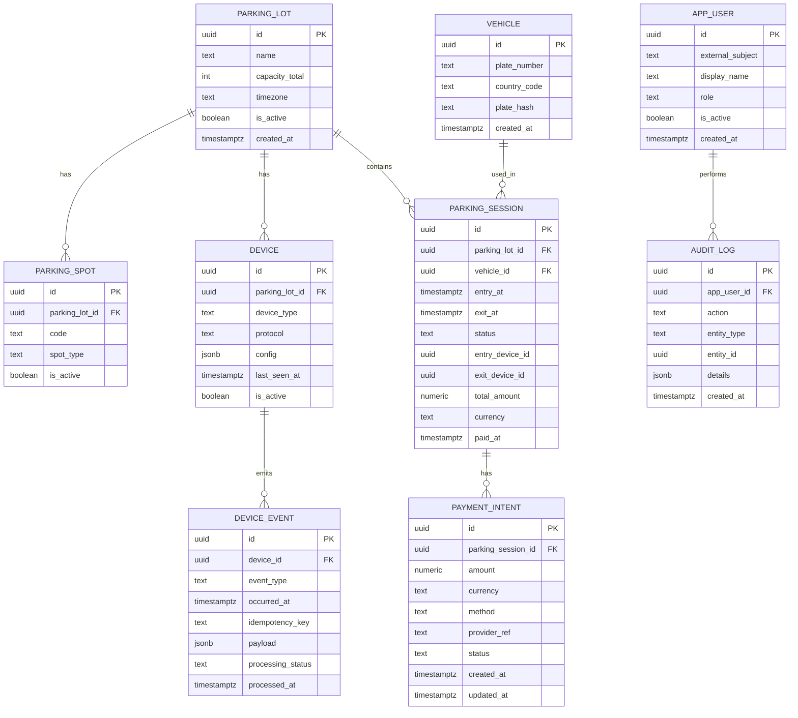
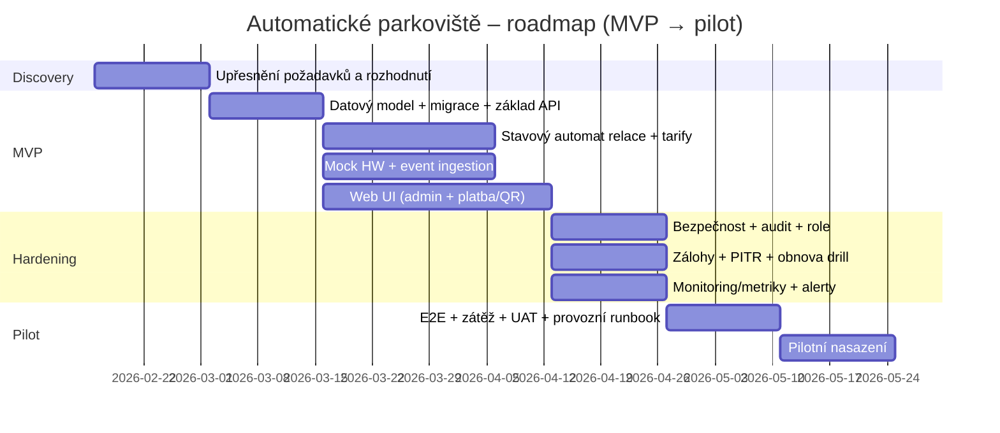

# Automatické parkoviště – návrh software, use-casy, datový model, API, nasazení, bezpečnost, testování a otázky pro klienta

## Exekutivní shrnutí

Navrhovaný systém je **self‑service automatické parkoviště** řízené přes **SPZ (LPR)**, **závory**, **senzory obsazenosti**, **informační tabuli u vjezdu** a **platbu před výjezdem** (karta / mobil / QR). fileciteturn0file0 Základní návrh je postaven tak, aby šel rychle dodat jako **MVP s HW mocky**, ale současně měl jasnou cestu k produkční integraci (REST/MQTT, audit, bezpečnost, zálohy, monitoring). fileciteturn0file0 citeturn10search0turn0search4turn5search15  

Klíčová architektonická rozhodnutí, která je nutné od klienta získat brzy (jinak se návrh bude měnit a prodraží se):  
- **Offline režim / edge vs. čistě centrální řízení** (co se má stát při výpadku internetu/centrálního backendu). fileciteturn0file0  
- **Platební integrace** (externí poskytovatel/terminály → dopad na PCI scope a provoz). fileciteturn0file0 citeturn2search3  
- **Retence a právní rámec pro SPZ a kamerové záznamy** (doby uchování, účely, audit). fileciteturn0file0 citeturn2search0turn2search6turn3search12  
- **Požadované SLA, počet parkovišť, počet zařízení, datové objemy** (nezadáno) – ovlivňuje HA, škálování, monitoring, náklady. fileciteturn0file0  

Doporučení pro dodání “bez bolesti”:  
- Realizovat jádro jako **stavový automat parkovací relace** (entry → active → paid → exit/closed) + **event log z HW** (i když zatím jen z mocků), aby se dobře řešily spory, audit a ladění. fileciteturn0file0 citeturn1search1turn1search8  
- Nasazení navrhnout ve variantách (on‑prem / cloud / hybrid), ale pro pilot a iterace preferovat **kontejnerizaci** a standardní orchestrace (rolling update, readiness/liveness, secrets/config). citeturn6search0turn6search8turn0search3turn0search9turn5search15  
- Telemetrii a statistiky držet jako **volitelný modul**, ale připravit API/DB tak, aby šly doplnit bez refaktoru (doménové metriky + technické metriky). fileciteturn0file0 citeturn1search19turn1search9turn1search3turn6search19  

Výstup níže je připraven tak, aby byl přímo použitelný pro plánování sprintu: obsahuje use‑casy, návrh ER/DB, API kontrakty, varianty nasazení, bezpečnostní minimum, test plán, návrh metrik a především **strukturovaný seznam otázek pro klienta** včetně “formuláře”. citeturn7search1turn7search0turn11search6  

## Kontext, předpoklady a hranice projektu

Systém má řídit automatizované parkoviště bez obsluhy, s identifikací vozidel pomocí SPZ (LPR), nepustit auto při plné kapacitě, sledovat obsazenost stání (senzor/kamera/smyčka), zobrazovat volná místa u vjezdu a evidovat čas příjezdu/odjezdu. fileciteturn0file0  

Platba probíhá **před výjezdem** (terminál / mobilní aplikace), podporované metody jsou karta, mobil, QR; systém rozlišuje krátkodobé vs dlouhodobé parkování a může mít zvýhodněné tarify (rezidenti, zaměstnanci). fileciteturn0file0  

Bezpečnostně a právně: požadavek na GDPR, role‑based přístup do administrace (správce, technik), omezená retence kamerových záznamů, logování operací, nouzový výjezd při poruše. fileciteturn0file0 citeturn2search0turn2search6turn1search1  

Technicky: backend na centrálním serveru, relační DB, komunikace se senzory přes REST/MQTT, webové UI, admin UI jen z interní sítě. fileciteturn0file0 citeturn10search0  

Analytika: denní/měsíční/roční statistiky (vytíženost, průměrná doba parkování, obrat), exporty dat, simulace vytížení. fileciteturn0file0  

Nezadáno (musí být vyjasněno, jinak se návrh může zásadně změnit):  
- Počet parkovišť a jejich topologie (1 lokalita vs síť), počet vjezdů/výjezdů, typy zařízení.  
- SLA/SLO (dostupnost, RTO/RPO), režim údržby, provozní podpora 24/7 (nezadáno, přitom systém běží 24/7). fileciteturn0file0  
- Objem dat a retenční politiky (parkovací relace, eventy, video), požadavky na anonymizaci/pseudonymizaci SPZ. citeturn2search0turn2search8turn3search12  
- Přesná tarifní pravidla (zaokrouhlování, free‑minutes, denní stropy, penalizace, ztracená SPZ apod.).  
- Platební poskytovatel a odpovědnost za PCI (nezadáno). citeturn2search3turn2search15  
- Mobilní aplikace: zda vůbec, a zda iOS (nezadáno). citeturn12search1  

## Klíčové funkce a detailní use‑casy

Funkčně je systém nejlépe chápat jako **“orchestrátor parkovací relace”**: z HW událostí (LPR, závorová jednotka, senzory) sestaví pravdu o tom, kdo je uvnitř, kolik je volno, kolik má zaplatit, a zda smí ven. fileciteturn0file0  

Následující tabulka je záměrně psaná tak, aby se z ní daly rovnou dělat backlogové itemy (MVP vs rozšíření je uvedeno v alternativách).

### Use‑case tabulka

| Use‑case | Aktéři | Předpoklady | Hlavní scénář | Alternativy / výjimky |
|---|---|---|---|---|
| Vjezd vozidla na parkoviště | Řidič, LPR, závora | Parkoviště není plné; LPR vrátí SPZ s dostatečnou jistotou. fileciteturn0file0 | 1) LPR na vjezdu přečte SPZ. 2) Systém ověří kapacitu. 3) Vytvoří parkovací relaci s časem příjezdu. 4) Otevře závoru. fileciteturn0file0 | A) Parkoviště plné → závoru neotevřít, zobrazit “plno” na tabuli. fileciteturn0file0 B) LPR nejisté/selže → fallback (ruční zadání na terminálu / obsluha hotline / “guest ticket”) – nezadáno. |
| Zobrazení obsazenosti u vjezdu | Řidič, informační tabule, senzory | Senzory poskytují obsazenost per stání nebo agregovaně. fileciteturn0file0 | 1) Systém průběžně počítá volná místa. 2) Publikuje číslo na informační tabuli. fileciteturn0file0 | A) Porucha části senzorů → přepnout na “kapacita minus aktivní relace” (méně přesné). B) Tabule offline → logovat a alertovat. |
| Parkování do vyhrazených míst (EV/ZTP/car‑sharing) | Řidič, admin, senzory | Místa mají typ; pravidla pro oprávnění jsou definována (nezadáno). fileciteturn0file0 | 1) Systém eviduje typy stání. 2) (Volitelné) při detekci obsazení vyhrazeného místa vozidlem bez oprávnění vytvoří incident. fileciteturn0file0 | A) Vyhodnocení oprávnění může být pouze “reporting” bez sankcí (MVP). B) Napojení na registr oprávnění (rezidenti, zaměstnanci) – nezadáno. |
| Zahájení platby podle SPZ | Řidič, platební terminál / web, backend | Existuje aktivní relace pro SPZ; tarif je znám. fileciteturn0file0 | 1) Řidič zadá/načte SPZ / QR. 2) Backend spočítá cenu dle tarifu a doby. 3) Vytvoří “payment intent”. 4) Terminál/prohlížeč provede platbu. fileciteturn0file0 | A) SPZ nenalezena → nabídnout “vyhledat podle času/vjezdu” (nezadáno). B) Tarifní pravidla složitá → tarifní engine s verzováním (doporučeno). |
| Platba kartou na terminálu | Řidič, terminál, payment provider | Terminál je integrován; neukládáme PAN; řeší se PCI scope (nezadáno). fileciteturn0file0 | 1) Terminál odešle požadavek na částku. 2) Provider vrátí výsledek. 3) Backend označí relaci jako “paid”. fileciteturn0file0 | A) Platba fail → relace zůstává “active”, nabídnout retry / jinou metodu. B) Refundace/storno – nezadáno (nutné doplnit). citeturn2search3 |
| Platba přes mobilní aplikaci / QR | Řidič, mobilní web/app, backend | Mobilní kanál existuje (nezadáno); identifikace relace QR / SPZ. fileciteturn0file0 | 1) Řidič otevře QR link / app. 2) Ověří relaci. 3) Zaplatí (platební brána). 4) Backend označí “paid”. fileciteturn0file0 | A) Bez mobilní aplikace: web (PWA) jako MVP. B) Nativní Android až pokud bude potřeba (nezadáno). citeturn12search1turn12search0 |
| Výjezd vozidla | Řidič, LPR, závora | Relace je paid nebo má nárok na bezplatný výjezd; LPR přečte SPZ. fileciteturn0file0 | 1) LPR na výjezdu čte SPZ. 2) Backend ověří “paid” a časový limit po platbě. 3) Otevře závoru. 4) Uzavře relaci s časem odjezdu. fileciteturn0file0 | A) Paid vypršel (timeout) → dopočítat doplatek. B) LPR fail → fallback (QR z terminálu, ruční ověření) – nezadáno. |
| Nouzový výjezd při poruše | Řidič, technik, závora | Nastane porucha, musí být umožněn výjezd. fileciteturn0file0 | 1) Technik aktivuje “fail‑open režim” (časově omezený). 2) Systém loguje operaci. 3) Výjezd se povolí bez platební kontroly. fileciteturn0file0 | A) Edge režim: lokální řídicí jednotka otevře bez backendu (nezadáno). B) Pozdější doúčtování/incidenty – nezadáno. |
| Správa tarifů | Správce | Existuje admin přístup s RBAC. fileciteturn0file0 | 1) Správce založí tarifní plán/verzi. 2) Nastaví pravidla. 3) Aktivuje od data. | A) Tarifní změny se musí auditovat a verzovat (doporučeno). citeturn1search1 |
| Správa zařízení a jejich stavu | Technik | Zařízení jsou evidována; periodicky hlásí heartbeat. | 1) Technik registruje zařízení (typ, protokol). 2) Sleduje last‑seen a chyby. 3) Spouští diagnostiku. | A) V MVP pouze evidence a ruční status. B) V produkci automatické alerty a metriky. citeturn1search19turn6search3 |
| Audit a dohledatelnost operací | Správce, auditor | Logy a audit trail jsou povinné. fileciteturn0file0 | 1) Každá admin akce vytvoří audit záznam. 2) HW eventy se ukládají (alespoň metadata). 3) Lze dohledat spor (čas, SPZ, platba, otevření závory). fileciteturn0file0 | A) Retence musí odpovídat GDPR a interním pravidlům; SPZ je osobní údaj (v CZ praxi explicitně potvrzováno). citeturn2search0turn3search12turn1search1 |
| Reporting a export dat | Správce, finance | Statistiky jsou požadovány; export formát nezadán. fileciteturn0file0 | 1) Systém generuje denní/měsíční/roční přehledy. 2) Umožní export (CSV/XLSX/API). fileciteturn0file0 | A) Automatická distribuce e‑mailem – nezadáno. B) Simulace vytížení – samostatný modul. fileciteturn0file0 |

## Návrh datového modelu a PostgreSQL schéma

Datový model je navržen tak, aby pokryl:  
- **operativu** (parkovací relace, platby, vjezdy/výjezdy), fileciteturn0file0  
- **zařízení a eventy** (HW integrace přes REST/MQTT, zatím mock), fileciteturn0file0 citeturn10search0  
- **audit a reporting** (logy, statistiky, export). fileciteturn0file0 citeturn1search1turn1search8  

Pro flexibilní části (např. payloady z HW, případně tarifní pravidla) používá JSONB, který je v PostgreSQL standardně podporovaný a indexovatelný (GIN). citeturn4search1turn4search5  

### ER diagram



### Tabulka entit a polí

| Entita | Účel | Klíčová pole (typ) |
|---|---|---|
| `parking_lot` | Konfigurace parkoviště (kapacita, tz) | `id uuid`, `name text`, `capacity_total int`, `timezone text`, `is_active bool`, `created_at timestamptz` |
| `parking_spot` | Stání + typ (standard/EV/ZTP/…) | `id uuid`, `parking_lot_id uuid`, `code text`, `spot_type text`, `is_active bool` |
| `device` | Evidence HW prvků (i mocků) | `id uuid`, `parking_lot_id uuid`, `device_type text`, `protocol text`, `config jsonb`, `last_seen_at timestamptz`, `is_active bool` |
| `device_event` | Nezměnitelný log HW událostí | `id uuid`, `device_id uuid`, `event_type text`, `occurred_at timestamptz`, `idempotency_key text`, `payload jsonb`, `processing_status text`, `processed_at timestamptz` |
| `vehicle` | Vozidlo identifikované SPZ | `id uuid`, `plate_number text`, `country_code text`, `plate_hash text`, `created_at timestamptz` |
| `parking_session` | Parkovací relace (entry→exit) | `id uuid`, `parking_lot_id uuid`, `vehicle_id uuid`, `entry_at timestamptz`, `exit_at timestamptz`, `status text`, `total_amount numeric`, `currency text`, `paid_at timestamptz` |
| `payment_intent` | Stav platby a integrace na providera | `id uuid`, `parking_session_id uuid`, `amount numeric`, `method text`, `provider_ref text`, `status text`, `created_at timestamptz` |
| `app_user` | Admin uživatel mapovaný z IdP | `id uuid`, `external_subject text`, `display_name text`, `role text`, `is_active bool` |
| `audit_log` | Auditní stopa admin akcí | `id uuid`, `app_user_id uuid`, `action text`, `entity_type text`, `entity_id uuid`, `details jsonb`, `created_at timestamptz` |

Poznámka k GDPR: SPZ může být osobní údaj, pokud je přiřaditelná konkrétní fyzické osobě; v českém kontextu byly publikovány materiály a rozhodnutí, kde je SPZ výslovně považována za osobní údaj. citeturn2search0turn3search12turn2search6  

### Základní PostgreSQL schéma

```sql
-- rozšíření (volitelné: uuid, crypto)
create extension if not exists "uuid-ossp";
create extension if not exists pgcrypto;

create table parking_lot (
  id uuid primary key default uuid_generate_v4(),
  name text not null,
  capacity_total int not null check (capacity_total >= 0),
  timezone text not null default 'Europe/Prague',
  is_active boolean not null default true,
  created_at timestamptz not null default now()
);

create table vehicle (
  id uuid primary key default uuid_generate_v4(),
  plate_number text not null,
  country_code text null,
  plate_hash text not null,
  created_at timestamptz not null default now(),
  unique (plate_hash)
);

create table parking_session (
  id uuid primary key default uuid_generate_v4(),
  parking_lot_id uuid not null references parking_lot(id),
  vehicle_id uuid not null references vehicle(id),
  entry_at timestamptz not null,
  exit_at timestamptz null,
  status text not null, -- ACTIVE, PAID, CLOSED, DISPUTED...
  entry_device_id uuid null,
  exit_device_id uuid null,
  total_amount numeric(12,2) null,
  currency text not null default 'CZK',
  paid_at timestamptz null
);

create index ix_parking_session_active
  on parking_session(parking_lot_id, status, entry_at desc);

create table payment_intent (
  id uuid primary key default uuid_generate_v4(),
  parking_session_id uuid not null references parking_session(id),
  amount numeric(12,2) not null check (amount >= 0),
  currency text not null,
  method text not null, -- CARD, MOBILE_APP, QR
  provider_ref text null,
  status text not null, -- INITIATED, AUTHORIZED, CAPTURED, FAILED...
  created_at timestamptz not null default now(),
  updated_at timestamptz not null default now()
);

create table device (
  id uuid primary key default uuid_generate_v4(),
  parking_lot_id uuid not null references parking_lot(id),
  device_type text not null, -- LPR, BARRIER, SENSOR, DISPLAY, TERMINAL
  protocol text not null, -- REST, MQTT
  config jsonb not null default '{}'::jsonb,
  last_seen_at timestamptz null,
  is_active boolean not null default true
);

create table device_event (
  id uuid primary key default uuid_generate_v4(),
  device_id uuid not null references device(id),
  event_type text not null,
  occurred_at timestamptz not null,
  idempotency_key text not null,
  payload jsonb not null,
  processing_status text not null default 'RECEIVED',
  processed_at timestamptz null,
  unique (device_id, idempotency_key)
);

create index ix_device_event_occurred_at
  on device_event(device_id, occurred_at desc);

create table app_user (
  id uuid primary key default uuid_generate_v4(),
  external_subject text not null unique,
  display_name text not null,
  role text not null, -- ADMIN, TECHNICIAN, FINANCE
  is_active boolean not null default true,
  created_at timestamptz not null default now()
);

create table audit_log (
  id uuid primary key default uuid_generate_v4(),
  app_user_id uuid not null references app_user(id),
  action text not null,
  entity_type text not null,
  entity_id uuid null,
  details jsonb not null default '{}'::jsonb,
  created_at timestamptz not null default now()
);

create index ix_audit_log_created_at on audit_log(created_at desc);
```

Použití rozšíření `pgcrypto` (např. pro hash/šifrování vybraných hodnot) je v PostgreSQL standardní možnost. citeturn4search2turn4search14  

Zálohování a obnova v PostgreSQL má standardní postupy (zálohy + WAL archiving pro PITR) a je vhodné je požadovat už od MVP prostředí, pokud má systém fungovat 24/7. citeturn0search4turn0search0  

## Návrh API kontraktů

API je navrženo primárně jako REST (snadné pro zařízení i FE) s tím, že pro admin dashboard lze volitelně přidat GraphQL (aby si UI tahalo přesně to, co potřebuje, a případně realtime přes subscriptions). citeturn7search5turn7search2turn12search3  

### REST principy a dokumentace

- Kontrakty publikovat přes OpenAPI (Swagger), aby šly generovat klienty, testy a validace. citeturn7search1turn7search0  
- Používat standardní HTTP statusy a významy dle HTTP Semantics a běžné praxe. citeturn7search3turn7search6  
- Chyby vracet jednotně (např. `application/problem+json`) a pro konflikty stavů (např. “už zaplaceno”) vracet 409. citeturn7search3turn7search6  

### Návrh endpointů

#### HW event ingestion (mock i budoucí reál)

`POST /api/v1/hw/events`

- Účel: Jednotný vstup pro všechny události (LPR read, barrier opened/closed, spot occupied/free, terminal payment result…).  
- Klíčové vlastnosti: **idempotence** (stejný event nesmí vytvořit duplicitní relaci/platbu), auditovatelnost (ukládá se `device_event`).  

```json
{
  "deviceId": "b5e1a4a2-8c4f-4b1c-8b1a-9b4b4e8f4a11",
  "eventType": "LPR_PLATE_READ",
  "occurredAt": "2026-02-16T12:34:56Z",
  "idempotencyKey": "cam-entry-0000123456",
  "payload": {
    "plate": "1AB2345",
    "confidence": 0.93,
    "lane": "ENTRY_1",
    "imageRef": "optional://blob/...",
    "direction": "IN"
  }
}
```

Odpověď:

```json
{
  "status": "ACCEPTED",
  "correlationId": "b0a2a3f2d2f14c8c9a3fbe3d8b0ea1a1",
  "processing": "ASYNC"
}
```

Poznámka: pokud část HW komunikace poběží přes MQTT, je vhodné udržet stejný event model (topic → eventType + payload). MQTT je standardní pub/sub protokol vhodný pro IoT scénáře. citeturn10search0turn10search4  

#### Operativní API pro FE / terminál

`GET /api/v1/parking-lots/{lotId}/status`

```json
{
  "lotId": "0f07f7d2-1a0c-4f36-9c3a-4fe3cc2b2a3c",
  "capacityTotal": 120,
  "occupied": 87,
  "free": 33,
  "calculatedAt": "2026-02-16T12:35:10Z"
}
```

`POST /api/v1/parking-sessions/quote`

- Účel: spočítat cenu “k teď” pro danou SPZ (pro terminál/mobil).

```json
{ "plate": "1AB2345" }
```

```json
{
  "sessionId": "c8f03a1f-2d1d-4e07-8f5a-41b1e4f8fd67",
  "entryAt": "2026-02-16T10:12:00Z",
  "now": "2026-02-16T12:36:00Z",
  "amount": 80.0,
  "currency": "CZK",
  "pricingBreakdown": [
    { "label": "časové parkovné", "amount": 80.0 }
  ]
}
```

`POST /api/v1/parking-sessions/{sessionId}/payment-intents`

```json
{
  "method": "CARD",
  "amount": 80.0,
  "currency": "CZK"
}
```

```json
{
  "paymentIntentId": "f1c94d1a-7a7a-4b7e-8c0b-6a2a9c3e2a11",
  "status": "INITIATED",
  "providerRedirect": null
}
```

`POST /api/v1/payments/{paymentIntentId}/confirm`

- Volá terminál / backend integrace po výsledku providera.

```json
{
  "providerRef": "psp-987654321",
  "status": "CAPTURED",
  "capturedAt": "2026-02-16T12:37:10Z"
}
```

#### Admin API

- `GET /api/v1/admin/sessions?from=&to=&plate=`  
- `POST /api/v1/admin/tariffs` (verzování, aktivace)  
- `GET /api/v1/admin/devices` (stav, last seen)  
- `GET /api/v1/admin/audit`  

Autorizace doporučeně přes JWT bearer + OIDC/OAuth dle standardního postupu v backendu (validace tokenu v API) a pro webové UI OIDC code flow s PKCE. citeturn0search2turn0search15  

### Volitelně GraphQL pro dashboard a realtime

Pro admin dashboard lze přidat GraphQL, protože podporuje query/mutation/subscription model a subscriptions jsou standardní mechanismus pro realtime update (typicky přes WebSocket). citeturn7search5turn7search2turn12search3turn7search15  

Příklad schema záměru (zkráceno):

```graphql
type Query {
  parkingLot(id: ID!): ParkingLot!
  activeSessions(lotId: ID!): [ParkingSession!]!
}

type Subscription {
  occupancyUpdated(lotId: ID!): OccupancyEvent!
}
```

## Architektura řešení, varianty nasazení a bezpečnost

### Architektura komponent

Logické komponenty (MVP → produkce):  
- FE (web): veřejná část (platba/QR) + admin portál (interní síť). fileciteturn0file0  
- Backend: API + tarifní engine + payment orchestrace + správa zařízení + reporting.  
- DB: transakční data + audit/event log.  
- HW vrstva: v MVP mock services; v produkci adaptér (REST/MQTT) na reálné zařízení. fileciteturn0file0  
- Observabilita: logy, metriky, tracing (volitelné). citeturn1search19turn1search12  

Backendové background úlohy (např. retence dat, generování statistik, import/export) jsou v .NET standardně řešitelné přes hosted services. citeturn10search2turn10search14  

Konfigurace a secret management v kontejnerizovaném prostředí typicky využívají ConfigMaps/Secrets. citeturn0search9turn0search3  

### Nasazení – možnosti a doporučení

Níže je realistický výběr pro tento typ systému. Rozhodnutí má dopad na dostupnost 24/7 a řešení výpadků. fileciteturn0file0  

| Varianta | Kdy dává smysl | Typické plus | Typické mínus |
|---|---|---|---|
| On‑prem (VM/metal) | požadavek na lokální provoz, omezení cloudu | plná kontrola, lokální latence | vyšší náklady na HA, zálohy, monitoring, patching |
| Cloud (AWS/Azure/GCP) | rychlé škálování, managed služby, iterace | standardní well‑architected principy (security/reliability/cost) | závislost na konektivitě lokality, governance |
| Hybrid (edge + cloud) | parkoviště musí fungovat i při výpadku internetu | nejlepší UX pro řidiče, robustní provoz | vyšší komplexita (sync, konflikty) |

Well‑Architected rámce u velkých cloudů zdůrazňují systematický přístup přes pilíře typu security/reliability/cost a mají použitelné checklisty pro návrh. citeturn8search0turn8search1turn8search2  

**Doporučení (default):**  
- Pro pilot/MVP: jednoduché nasazení (1–2 prostředí) s možností přechodu na K8s bez přepisu (tedy kontejnerizace už od začátku). Rolling updates jsou standardní mechanismus pro bezvýpadkové nasazování v orchestraci. citeturn6search8turn6search0  
- Pro produkci: pokud klient nepotřebuje striktní on‑prem a konektivita lokality je spolehlivá, je nejnižší operativní riziko využít **managed DB + orchestraci**; jinak hybrid. Zálohy a PITR pro PostgreSQL jsou standardní požadavek u 24/7 systému. citeturn0search4turn0search0  

### Bezpečnostní opatření

Bezpečnostní návrh je postaven na tom, že systém zpracovává osobní údaje (SPZ, případně video) a musí být auditovatelný. fileciteturn0file0 citeturn2search0turn3search12turn1search13  

Autentizace a autorizace:  
- Admin přístup řešit přes OIDC (centrální IdP) a backend ověřuje JWT bearer tokeny; Microsoft dokumentace explicitně popisuje konfiguraci JWT a OIDC a doporučuje standardní postupy. citeturn0search2turn0search15  
- Role‑based a policy‑based autorizace pro akce typu “správce vs technik”, s minimem práv (“least privilege”). citeturn11search0turn11search4turn11search8  
- Rate limiting pro veřejné endpointy (quote/payment start) proti zneužití. citeturn5search7turn5search3  

Šifrování a ochrana dat:  
- TLS pro komunikaci FE↔API i zařízení↔API (nebo přes gateway).  
- Citlivé hodnoty lze šifrovat na aplikační vrstvě; na DB lze použít kryptografické funkce (pgcrypto), ale ne jako náhradu za celkovou bezpečnostní architekturu. citeturn4search2turn11search15  
- Data Protection v .NET řeší správu a rotaci klíčů pro ochranu payloadů a má standardní mechanismus pro key management. citeturn11search1turn11search15  

Audit, logování, monitoring:  
- Bezpečnostní logy musí zahrnovat klíčové události (login, neúspěšné pokusy, změny tarifů, high‑value operace, nouzové režimy). OWASP zdůrazňuje, že bez logování/monitoringu nelze incidenty efektivně detekovat. citeturn1search1turn1search8  
- Logy standardizovat (strukturované), chránit před manipulací, definovat retenci a přístupy. citeturn1search1turn1search5  

Zálohy a obnova:  
- Zálohování a PITR pro PostgreSQL (base backup + archivace WAL) a pravidelný restore drill. citeturn0search4turn0search0  

Kontejnerové prostředí:  
- Citlivé konfigurace držet v “secrets” a oddělit od image; logika je popsána v dokumentaci ke Kubernetes Secrets a ConfigMaps. citeturn0search3turn0search9  

Platby:  
- Pokud systém pracuje s kartami přes terminál/PSP, cílem je minimalizovat PCI dopad (neukládat cardholder data, delegovat na certifikovaného poskytovatele). PCI DSS quick reference shrnuje zásady pro prostředí, kde se zpracovávají platební údaje. citeturn2search3turn2search15  

## Plán testování, mock HW, provozní režim a telemetrie

### Test strategie

Testy je vhodné členit podle vrstev a rizik:

- Unit testy: tarifní engine (zaokrouhlení, free‑minutes, stropy), stavový automat relace, validace eventů, RBAC pravidla.  
- Integrační testy: DB integrace (migrace, indexy, transakce), idempotence event ingestion, výpočet obsazenosti. EF migrace jsou standardní mechanismus pro evoluci schématu. citeturn5search8turn5search1  
- Integrační testy s reálnou DB v CI: doporučit kontejnerovou DB přes entity["organization","Testcontainers","container testing project"] (PostgreSQL modul) – snižuje potřebu lokální instalace DB a dává realistické testy. citeturn9search3turn9search13  
- E2E testy: kritické cesty admin portálu a veřejného “plate→pay→exit” toku. entity["organization","Playwright","browser testing framework"] podporuje víc prohlížečů a .NET bindingy. citeturn9search0turn9search14  
- Bezpečnostní testy API: řídit se OWASP WSTG sekcí pro API testing (včetně GraphQL, pokud bude). citeturn13search7turn13search3  
- Zátěžové testy: pro vjezdy/výjezdy/platby (spike ráno/odpoledne), nástrojově je běžný k6 (má přímo API load testing guide). citeturn13search4turn13search2  

### Mock services pro HW

Protože HW prvky mají být zatím reprezentované mocky, doporučený přístup je:  
- Vytvořit “Device Simulator” (service) schopný:  
  - emitovat MQTT/REST eventy (LPR read, spot occupied/free, barrier state), citeturn10search0turn10search1  
  - přijímat příkazy (open barrier) a vracet potvrzení,  
  - generovat poruchové scénáře (zpoždění, duplikace eventů, out‑of‑order).  

Testovací scénáře, které musí být v mocku (aby se odhalily reálné provozní chyby):  
- duplikovaný event (ověření idempotence),  
- výpadek senzorů části stání,  
- LPR “misread” (jiná SPZ nebo confidence pod prahem),  
- závora “neotevřela / neuzavřela”,  
- platba potvrzena pozdě (race condition mezi výjezdem a confirm).  

### Provozní minimum pro 24/7

- Health checks: readiness/liveness pro API (DB dostupnost vs start). .NET dokumentace popisuje oddělení readiness a liveness, typicky používané v orchestraci. citeturn5search15turn5search2  
- Bezvýpadkové nasazování: rolling update (orchestrace). citeturn6search8turn6search0  
- Incident “nouzový výjezd”: musí být auditovaný a role‑ověřený. fileciteturn0file0 citeturn1search1  

### Statistiky, metriky a ukázkové dashboardy

Telemetry je volitelná (nezadáno), ale návrh doporučuje připravit základní měření, protože systém je 24/7 a bez metrik se špatně ladí závory, platby a SLA. fileciteturn0file0 citeturn1search19turn1search8  

Doporučený stack:  
- entity["organization","OpenTelemetry","observability framework"] pro vendor‑neutral instrumentaci (traces/metrics/logs) a korelaci signálů. citeturn1search19turn1search12turn1search2  
- entity["organization","Prometheus","monitoring system"] metriky – typy metrik (counter/gauge/histogram/summary) jsou definované a mají praktické “do/don’t”. citeturn1search3turn1search20  
- entity["organization","Grafana","observability dashboards"] dashboardy + alerting; má přímou podporu Prometheus datasource. citeturn6search3turn6search19turn6search7  

Co měřit (minimální sada pro “operativní pravdu”):  
- Doménové metriky:  
  - `parking_sessions_active` (gauge)  
  - `parking_entry_denied_total{reason="FULL"}` (counter)  
  - `payment_success_total`, `payment_failed_total` (counter)  
  - `time_to_open_barrier_ms` (histogram)  
  - `lpr_confidence` (histogram/summary)  
- Technické metriky:  
  - latence API (`http_server_duration`), chybovost 5xx, 4xx, 429 (rate limiting),  
  - DB latence query a pool saturation,  
  - fronta HW eventů “received vs processed” a backlog.  

Ukázkový dashboard “Provoz v reálném čase” (ASCII náčrt):

```
Obsazenost (posl. 60 min)  [free spots]
60 |■■■■■■■■■■■■■■■■■■■■■■■■■■■■■■■■■■■■■■
40 |■■■■■■■■■■■■■■■■■■■■■■■■■■
20 |■■■■■■■■■■■■
 0 +---------------------------------------> čas

Platby (posl. 15 min)  success vs fail
OK:  ████████████████  128
FAIL ███               12

HW event backlog
RECEIVED:  5/min
PROCESSED: 5/min
BACKLOG:   0  ✅
```

Ukázkový dashboard “Finance a tarif”:  
- obrat denně/týdně/měsíčně, průměrná platba, top výjimky, podíl slev (rezident/zaměstnanec), průměrná doba parkování. fileciteturn0file0  

## Rizika, otevřená rozhodnutí, roadmap a otázky pro klienta

### Rizika a otevřená rozhodnutí

Největší rizika jsou “neviditelná” – vznikají z nevyjasněných provozních detailů:

- Offline režim: bez rozhodnutí (edge vs central) nelze garantovat UX a bezpečnost (např. nouzový výjezd, platby při výpadku). fileciteturn0file0  
- Právní rámec SPZ a kamer: bez jasné retence/účelů a informační povinnosti hrozí nesoulad s GDPR; v CZ praxi je SPZ posuzována jako osobní údaj. citeturn2search0turn2search6turn3search12  
- Platby a PCI scope: špatně zvolená integrace může dramaticky zvýšit compliance náklady. citeturn2search3turn2search15  
- Integrace HW: REST/MQTT eventy budou v reálu chybové (duplicitní, opožděné); bez idempotence a event logu se systém “rozjede”. citeturn10search0turn1search1  
- SLA/HA: požadavek 24/7 s minimálními výpadky vyžaduje rozhodnutí o zálohách/PITR, failover, monitoringu. fileciteturn0file0 citeturn0search4turn0search0turn1search19  

### Roadmap a odhad práce

Odhady jsou nutně v rozsazích (protože počet zařízení, SLA, tarifní pravidla a platební integrace jsou nezadáno). fileciteturn0file0  

Předpoklad: MVP s HW mocky, platbou přes “simulovaný provider”, admin základ. Následně hardening a pilot.

**Rámcový odhad (rozsahy):**  
- MVP (core relace + kapacita + terminálový tok + admin minimum + mock HW): **60–110 MD** nebo **160–280 SP**  
- Produkční připravenost (security hardening, monitoring, PITR, load testy, incident režimy): **40–90 MD** nebo **120–240 SP**  
- HW integrace (reálné protokoly, testy s dodavatelem, certifikace, tuning): **30–120 MD** (extrémně závislé na HW)  



### Zásadní otázky pro klienta

Níže jsou otázky rozdělené dle požadovaných oblastí. Typ odpovědi je záměrně jednoduchý (ano/ne, výběr, krátký text), aby se daly poslat jako formulář.

#### Obchodní požadavky
- Je cílem jen jedno parkoviště, nebo síť více lokalit? (výběr: 1 / více / nezadáno)  
- Kolik vjezdů a výjezdů má lokalita? (krátký text / číslo / nezadáno)  
- Má být umožněno parkování bez registrace vždy? fileciteturn0file0 (ano/ne)  
- Co přesně znamená “dlouhodobé parkování” (tarif, paušál, abonent)? fileciteturn0file0 (krátký text)  
- Jaké slevové skupiny jsou potřeba (rezidenti, zaměstnanci, další)? fileciteturn0file0 (výběr + krátký text)  
- Jak se řeší sporné situace (LPR špatně přečte, řidič reklamuje)? (krátký text)  
- Je požadovaná podpora více jazyků na terminálu/webu? (výběr: CZ / CZ+EN / jiné)  
- Má být simulace vytížení součástí MVP, nebo později? fileciteturn0file0 (výběr: MVP / později / ne)

#### Data a integrace
- Budou existovat externí seznamy oprávnění (rezidenti/zaměstnanci) a odkud (HR systém, městská evidence)? fileciteturn0file0 (ano/ne + krátký text)  
- Jaké je očekávané množství relací/den a požadovaná doba uchování relací? (krátký text / nezadáno)  
- Má být export dat automatizovaný (např. denně do S3/Drive) nebo manuální? fileciteturn0file0 (výběr)  
- Požadujete integraci na účetnictví / fakturaci? (ano/ne + krátký text)

#### UX/FE
- Budou dvě UI: veřejné (platba/QR) a admin (interní síť)? fileciteturn0file0 (ano/ne)  
- Požadujete “kiosk mode” pro terminálový prohlížeč? (ano/ne)  
- Jaké role v admin UI (správce, technik, finance…)? fileciteturn0file0 (výběr + krátký text)  
- Musí být UI dostupné i z mobilu (responsive), nebo čistě desktop? (výběr)

#### Backend/API
- Preferujete event processing synchronně (čekat na výsledek) nebo asynchronně (ACK + zpracování)? (výběr)  
- Jaký je požadovaný maximální čas otevření závory po přečtení SPZ? (krátký text / nezadáno)  
- Je potřeba multi‑tenant (více provozovatelů v jedné instanci)? (ano/ne/nezadáno)  
- Jaké audity jsou povinné (kdo co změnil, kdy, odkud)? fileciteturn0file0 (krátký text)

#### Mobilní aplikace
- Je mobilní aplikace nutná, nebo stačí mobilní web (PWA)? (výběr: PWA / Android / Android+iOS / nezadáno)  
- Pokud Android: má být nativní (Kotlin) nebo hybrid? (výběr: Kotlin / jiné / nezadáno) citeturn12search1turn12search0  
- Má app dělat jen platby, nebo i notifikace (např. “končí čas”) / účty uživatelů? (krátký text)

#### Nasazení a bezpečnost
- Kde musí běžet systém: on‑prem / cloud / hybrid? (výběr)  
- Existuje korporátní IdP (SSO) pro admin přístup? (ano/ne + jaký) citeturn0search15  
- Požadujete VPN/privátní síť pro zařízení (senzory, kamery)? (ano/ne/nezadáno)  
- Retence SPZ a logů (kolik dní/měsíců)? (krátký text) citeturn2search0turn3search12  
- Retence kamerových záznamů (kolik dní) a účel (bezpečnost, reklamace…)? fileciteturn0file0 (krátký text) citeturn2search6  
- Povinné šifrování (at rest / in transit) a požadavky na klíče (KMS/HSM)? (výběr + kr. text)

#### Testování a provoz
- Požadované SLA/SLO (dostupnost, reakční časy podpory)? (krátký text / nezadáno)  
- Kolik prostředí (dev/stage/prod) a kdo schvaluje nasazení? (krátký text)  
- Má být povinné pravidelné restore testování záloh? (ano/ne) citeturn0search4turn0search0  
- Budou se dělat penetrační testy externě? (ano/ne/nezadáno) citeturn13search7  

#### Statistiky / telemetrie
- Jsou statistiky povinné, nebo “nice to have”? fileciteturn0file0 (výběr)  
- Jaké KPI jsou klíčové (vytíženost, průměrná doba, obrat – potvrdit/rozšířit)? fileciteturn0file0 (výběr)  
- Potřebujete realtime dashboard pro technika? (ano/ne)  
- Jak dlouho držet telemetrická data? (krátký text)

#### HW mocky
- Která zařízení budou v MVP mockovaná (LPR, závora, senzory, tabule, terminál)? fileciteturn0file0 (výběr)  
- Jaké protokoly preferuje dodavatel HW (REST, MQTT, jiné)? fileciteturn0file0 (výběr + kr. text)  
- Jaké chybové stavy musí mock umět (duplikace eventů, latency, výpadek)? (výběr)  

### Formulář pro klienta

| Otázka | Typ odpovědi | Volby |
|---|---|---|
| Počet parkovišť (1 vs více)? | výběr | 1 / více / nezadáno |
| Počet vjezdů/výjezdů? | krátký text | číslo |
| Offline režim nutný? | výběr | ano / ne / nezadáno |
| Platební kanály | výběr | karta / mobil / QR / kombinace |
| Poskytovatel plateb | krátký text | název / nezadáno |
| Retence SPZ | krátký text | např. 30 dní / nezadáno |
| Retence kamerových záznamů | krátký text | např. 72 hodin / nezadáno |
| Role v administraci | výběr + text | správce / technik / finance / jiné |
| Slevové skupiny | výběr + text | rezidenti / zaměstnanci / jiné |
| Statistiky povinné? | výběr | ano / ne / nice-to-have |
| Export dat | výběr | manuální / automat / API |
| Nasazení preference | výběr | on‑prem / cloud / hybrid |
| Mobilní aplikace potřeba? | výběr | ne / PWA / Android / Android+iOS |
| Protokol HW | výběr | REST / MQTT / jiné |
| SLA/SLO | krátký text | % dostupnosti, reakce |

### Dodatečné otázky pro později

- Chcete “dynamické ceny” (peak/off‑peak, event pricing) a jak se schvalují?  
- Požadujete integraci na kamerovou analytiku (např. kontrola parkování mimo stání)? fileciteturn0file0  
- Potřebujete právní režim pro sankce/penále a evidenci incidentů?  
- Budou existovat fyzické “předplatné” (RFID/QR karta), nebo jen SPZ?  
- Potřebujete veřejné API pro třetí strany (např. navigace na volná místa)?
